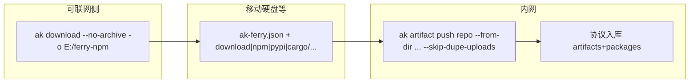

# TB 级空气隔离摆渡架构

## 现状为何撑不住

当前闭环是：


硬伤（对 100GB～TB）：

- 默认 `MAX_UPLOAD_SIZE=10GiB`；extract 预算默认 50GiB
- 服务端峰值磁盘 ≈ **存档 + 临时 zip + 解压树** ≈ **2～3×**
- Go/npm/cargo ingest 仍整包进内存；只有 PyPI 流式
- 无持久 job/租约
- 小 zip 四生态测试只打到 PUT 直传，没验证大包路径

## FAQ：坚持单 ZIP / 客户端解压 vs 服务端解压

### 1. 坚持单 ZIP，最大能支持多大？

产品承诺：**流式 ingest 后单 ZIP 实用上限 ~100GiB**；近 TB 不承诺单 ZIP。调参可抬上传/解压限额，但磁盘 2～3× 与单点故障仍在。

### 2. 客户端展开上传 vs ZIP 整包上传服务端解？

内网 ≥100MB/s 时网络都是 ≈S；**更快、服务端 IO 更少的是客户端扫目录/按 entry 上传**。整包上传再服务端解多出一整遍落盘+扫描。

## 目标形态（定案）

**大包主路径：不压缩目录摆渡 + 客户端扫目录上传**（与已有 `--from-dir` 配套）。
单 ZIP / 服务端解压保留给小包；TB/百 GB 不以单 ZIP 为承诺。



### Download 配套：`--no-archive`（不打 zip）

在 [`download/engine.rs` `finish_ferry`](C:/Users/Administrator/Documents/GitHub/artifact-keeper-cli/src/commands/download/engine.rs) 今日默认 `zip_dir(payload)`。新增：

- CLI / job / config：`--no-archive`（或 `archive = false`）
- `-o` / `output` 指向**目录**（可直接是移动硬盘），例如 `E:\ferry\ak-ferry-npm-20260818`
- 行为：把 `payload/` 树（`ak-ferry.json` / `.jsonl` + 生态子树）**同步/移动到该目录**，**跳过 `zip_dir`**；清理临时 work 时勿删介质上的产物
- 自动命名：目录名复用现有 zip 命名规则（无 `.zip`），落在 `output_dir`
- 结束提示改为：

```text
Wrote E:\ferry\ak-ferry-npm-… (N roots, M packages).
On intranet:
  ak artifact push <eco>-local --from-dir <that-dir> --skip-dupe-uploads
```

- `--catalog` 增量跳过仍适用（少下即少拷盘）

### Download UX：默认进度条，详日志需显式打开

今日 `ak download` 大量 `eprintln`（每个 root / `npm pack` / skip cached），大仓刷屏。改为：

| 模式 | 行为 |
|------|------|
| **默认** | stderr：**进度条**（roots 或 modules：`done/total`，可选当前 spec 作 `msg`）；**仅错误**即时打印 + 结束时失败汇总（沿用 `errors.rs`）；成功时一行摘要（路径 / roots / packages） |
| **`--verbose` / `-v`** | 恢复今日逐步日志（proxy/registry、每个 pass、skip cached、pack 等） |
| **`--quiet` / `--format quiet`** | 仍只输出主产物路径（stdout），无进度条、无摘要文案 |

实现要点：

- 在 [`download/mod.rs`](C:/Users/Administrator/Documents/GitHub/artifact-keeper-cli/src/commands/download/mod.rs) SharedArgs 增加 `verbose: bool`；传入 `FerryOpts`；各生态 `quiet` 语义扩展为：`!verbose && !quiet_format` → 进度条模式（不是完全静默）
- 进度条用现有 `indicatif`（与 chunked upload 一致）；TTY 才画条，非 TTY 可退化成偶发 `N/M` 一行或保持静默+错误
- 禁止用全局 `--format table` 当「详细」；详日志只认 `--verbose`
- 与 `--no-archive` 同批落地（同属 download 体验）

### Push 配套：扫目录必须协议正确（补齐缺口）

已有 [`--from-dir`](C:/Users/Administrator/Documents/GitHub/artifact-keeper-cli/src/commands/artifact.rs)：

- **Go**：已识别 GOPROXY cache → `/go/...` 协议上传
- **npm / pypi / cargo**：今日仅通用 artifacts 上传，**不会**走生态协议/索引 → 对 ferry 目录不够

与 `--no-archive` 成套时，`--from-dir`（或 `ferry-import`）须识别 ferry 根（存在 `ak-ferry.json`），并按与服务端 ingest 相同的路径→坐标映射做协议上传；并行有界 + `--skip-dupe-uploads`。

| 生态 | 目录布局 | 内网上传 |
|------|----------|----------|
| go | `download/{encoded}/@v/...` | 已有 `go_proxy` |
| npm | `npm/.../*.tgz` | 协议等价 store_npm |
| pypi | `pypi/{name}/{filename}` | 流式/协议 |
| cargo | `cargo/*.crate` | 协议等价 store_cargo |

### 与 ZIP 的关系

| 场景 | 推荐 |
|------|------|
| 介质=移动硬盘/SSD，百 GB～TB | **`--no-archive` → `--from-dir`**（主路径） |
| 只要一个文件、数 GB 级 | 默认打 zip / `--from-archive` |
| 单卷刻盘等 | 以后可选 tar 分卷；仍优先目录 |

第一期**直接复用现有 payload 树**；CA `blobs/sha256/...` 作后期加强。继续用 `ak repo catalog` + `download --catalog` 做增量。

## 分阶段落地

### P0 — 堵住已知断路 + 容量旋钮

- chunked `/complete` → `spawn_ingest`；CLI finalize 提示
- 调高 `MAX_UPLOAD_SIZE` / extract（过渡）
- 强制分片四生态 E2E

### P1 — Download `--no-archive` + UX + ferry 目录 `--from-dir`（大包主路径）

- `finish_ferry`：目录输出、跳过 zip、介质安全清理、提示
- clap / TOML：`no_archive`；自动目录命名
- download **默认进度条 + 仅错误**；`--verbose` 恢复逐步日志
- `--from-dir` 识别 `ak-ferry.json`：npm/pypi/cargo 协议入库；并行 + skip-dupe
- E2E：四生态 download 到目录 → push --from-dir → 客户端验证

### P2 — 流式服务端 zip ingest（小包 ZIP）

- 单 ZIP ≤~100GiB：按 entry 流式、sha256、可续跑
- 不作为 TB 主路径

### P3 — 目录布局强化 / 任务与存储

- 可选 CA blob、volumes、持久 job、对象存储 multipart、GC

## 明确不做

- 不以「单 TB Deflated ZIP + 服务端全量解压」为产品承诺
- 不在单进程内存合并 TB
- 不以低配 Linux AMD64 部署机本机编译验证 TB

## 成功标准

| 级别 | 标准 |
|------|------|
| 目录摆渡 | `download --no-archive` 直写介质；`push --from-dir` 四生态协议正确；skip-dupe 可续传 |
| download UX | 默认进度条+仅错误；`--verbose` 详日志；`--quiet` 仍只打路径 |
| 100GB 目录 | 墙钟≈网络传输；服务端磁盘≈1×；可中断续传 |
| 近 TB | 同目录路径 + catalog 增量；不依赖单 ZIP |
| ZIP 兼容 | 小包 zip 仍可用；流式后单 ZIP 实用上限 ~100GiB |
